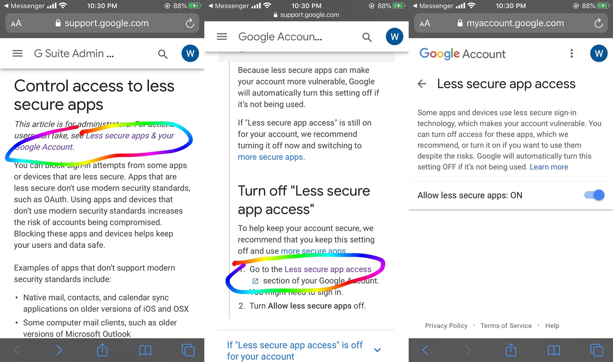

# Homify 🏠
Home Automation with RPi and Motion sensor

### Installation
You can install all the dependencies at once by running the following command from your terminal.
``` python
    $ pip install -r requirements.txt
```
### Running

```python
    $ python HomeSecurity.py
 ```


### Gmail Settings
Change you gmail settings to receive mail otherwise gmail will block the incoming mails from the script.


